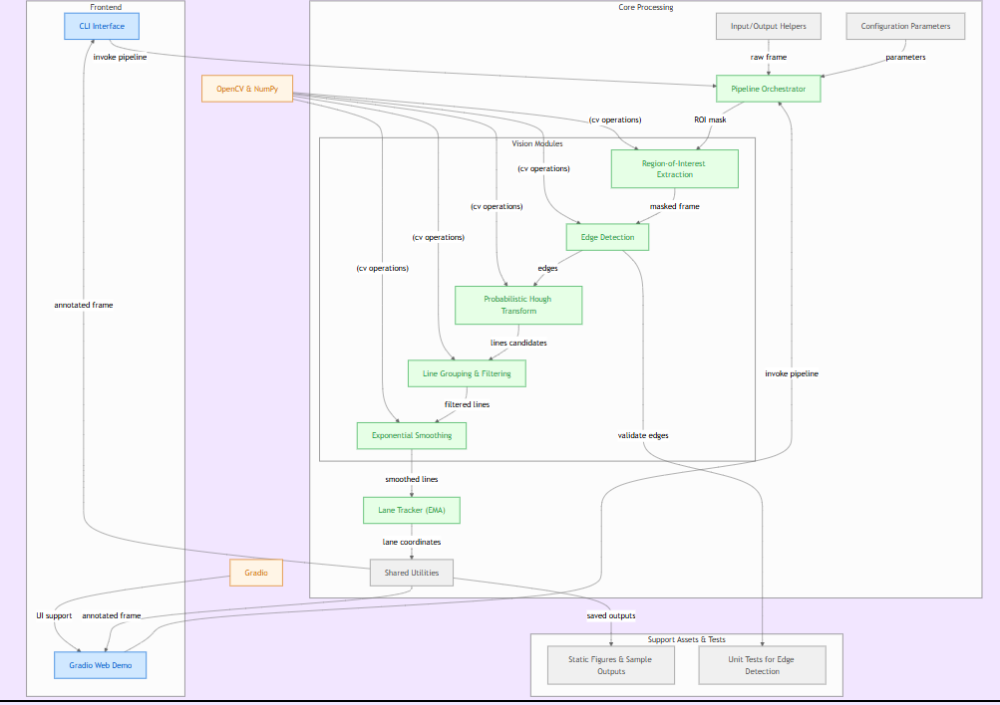
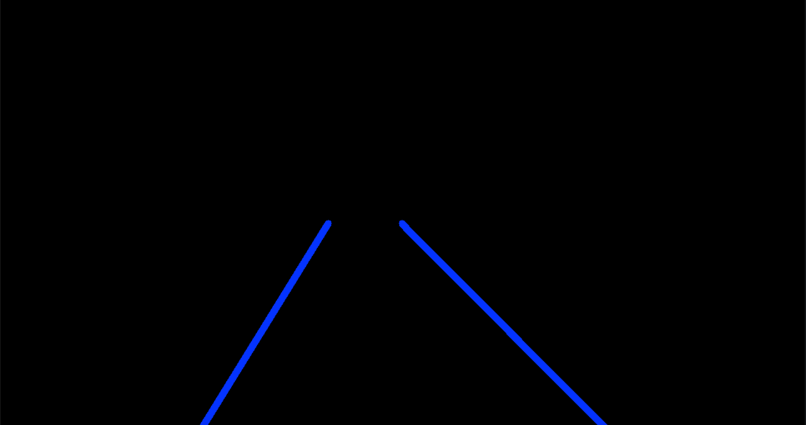
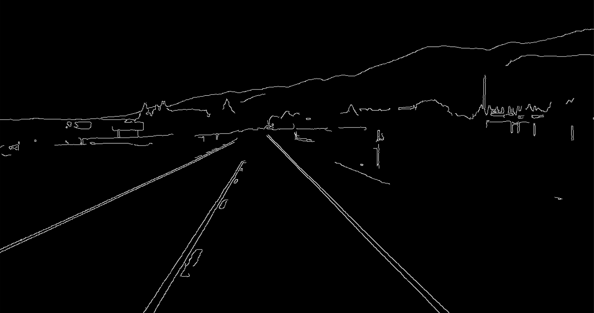
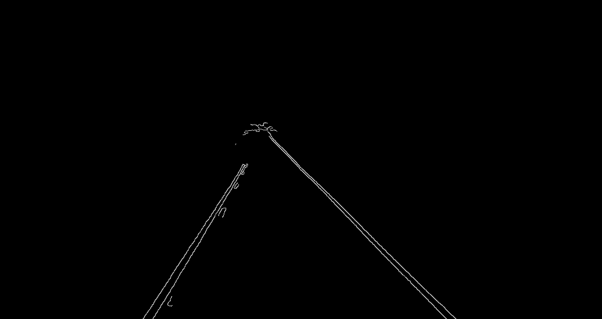
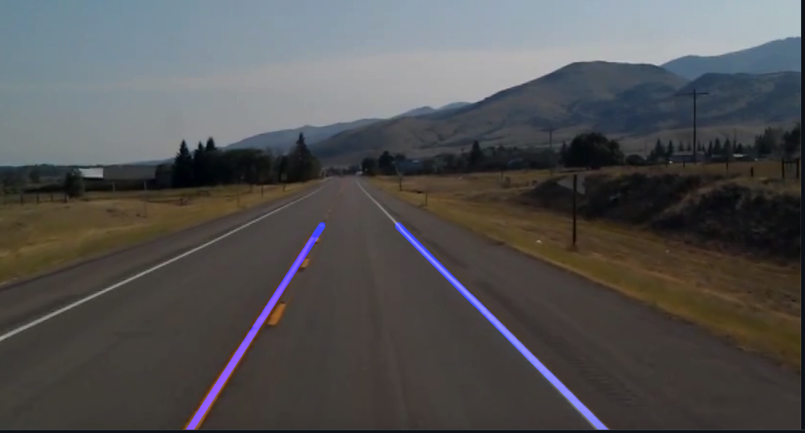

# 🧭 NeuroDrive-Vision  
### ⚙️ Advanced AI-Powered Lane Detection & Road Perception Framework  

---

## 🚀 Overview  

**NeuroDrive-Vision** 🚗💡 is an **AI-powered lane detection and road perception system** engineered to replicate the *core vision intelligence* of autonomous vehicles.  
It brings together the **precision of classical computer vision** and the **robustness of modern modular architecture**, enabling both **real-time performance** and **research-grade extensibility**.

### 🧠 Core Philosophy  
The goal of NeuroDrive-Vision is not just to detect lanes — but to **perceive the road like a driver would**, using a structured vision pipeline that interprets motion, geometry, and perspective in a consistent, explainable way.

Each stage of the system works as an intelligent, pluggable module that you can **enhance, swap, or train** for different environments (urban roads, highways, or race tracks).  
This makes the framework perfect for:
- 🔬 **Research & prototyping** of autonomous driving perception stacks  
- 🏎️ **Real-time applications** for road boundary detection  
- 🧩 **Educational demonstrations** in AI, OpenCV, and perception systems  

---

### 🌟 Key Highlights  
| 💡 Feature | 🧾 Description |
|-------------|----------------|
| ⚙️ **End-to-End Pipeline** | From raw frame to annotated lane overlay — each step modularized and independently testable. |
| 🧩 **Adaptive ROI Mapping** | Automatically adjusts to different video resolutions and camera perspectives. |
| 🧠 **Exponential Smoothing (EMA)** | Maintains lane stability by learning temporal motion between frames. |
| 🚀 **Real-Time Performance** | Optimized OpenCV operations achieve 30–60 FPS on modern CPUs. |
| 🌐 **Dual Interface Support** | Command-Line (CLI) for automation and Gradio Web App for live visual demos. |
| 📦 **Dockerized Deployment** | Build once, deploy anywhere — consistent behavior across environments. |
| 🧰 **Research-Grade Modularity** | Every component is decoupled, documented, and open for fine-tuning or replacement. |

---

### 🧠 Developed With  
- 🧩 **Python 3.11+** for modern type-safe design  
- 🧮 **NumPy** for high-speed numerical computation  
- 👁️ **OpenCV** for robust image transformation and edge processing  
- 💻 **Gradio** for web-based visualization and user interaction  
- 🧱 **Docker** for deployment and scalability  

> 🧠 Developed with ❤️ by **mwasifanwar**  
> 🔗 _A vision system that learns, adapts, and drives._

---

## 🧩 Architecture  

The architecture of **NeuroDrive-Vision** is designed for **clarity, extensibility, and real-time flow**. Each module performs a focused task and hands off its output to the next — resulting in a clean and efficient processing pipeline.

---

### 🧠 High-Level System Flow  

🚦 **1. Frontend Layer**
- 🖥️ **CLI Interface**: Enables headless operation for batch video processing and automation.
- 🌐 **Gradio Web Demo**: Provides a user-friendly browser interface for real-time experimentation.
- 💬 Both interfaces invoke the same backend pipeline ensuring identical detection logic.

⚙️ **2. Core Processing Layer**
- 🧩 The *heart* of the system, where all computer vision operations happen.
- Comprised of modular stages:
  - 🟣 **Edge Detection (Canny Algorithm)** — Extracts fine boundaries and gradients from raw frames.  
  - 🟢 **Region of Interest (ROI) Extraction** — Masks irrelevant regions, focusing on lane-relevant areas.  
  - 🟡 **Probabilistic Hough Transform** — Converts edge data into line candidates using polar coordinates.  
  - 🔵 **Line Grouping & Averaging** — Filters and merges left/right lane boundaries.  
  - 🟠 **Exponential Smoothing (EMA)** — Stabilizes detection across time for a fluid driving experience.

🧰 **3. Shared Utilities & Configuration**
- 🧾 **Config Manager** — Stores and handles parameters (thresholds, kernel sizes, ROI shapes, etc.).
- 💾 **Input/Output Helpers** — Manage frame capture, video writing, and batch processing.
- ⚙️ **Tracker Module (EMA-based)** — Tracks lane continuity between consecutive frames.
- 🧮 **Math & Geometry Utilities** — Support transformations and vector calculations.

📦 **4. Output & Visualization**
- 🎥 Annotated video frames with smooth blue lane overlays.
- 📊 Optional visualization of each processing stage (edges, ROI, smoothed lanes).
- 🌐 Displayed interactively via Gradio or saved locally.

---

### 🧬 Architecture Diagram  

  

---

### 🔍 Data Flow Summary  

| 🔢 Step | 🧠 Process | 🎯 Output |
|:--------|:------------|:-----------|
| 1️⃣ | Raw frame input via OpenCV | RGB frame |
| 2️⃣ | Canny Edge Detection | Binary edge map |
| 3️⃣ | Region of Interest Extraction | Masked edge image |
| 4️⃣ | Hough Transform | Line segments |
| 5️⃣ | Line Averaging & Filtering | Merged lane candidates |
| 6️⃣ | Exponential Smoothing | Stable, smoothed lanes |
| 7️⃣ | Overlay Rendering | Annotated driving frame |

---

### ⚙️ Architectural Philosophy  

> 💬 **"Each module in the NeuroDrive pipeline is designed to think like a neuron — specialized, fast, and connected."**

- 🧠 **Parallelizable** — Future GPU or TensorRT integration ready.  
- 🧩 **Plug-and-Play Modules** — Swap Canny with Sobel, or add a DNN-based lane segmentation head.  
- 🔄 **Bidirectional Data Flow** — Supports feedback loops for model fine-tuning and adaptive thresholds.  
- 🧰 **Layer Independence** — Frontend, core, and utilities operate independently with defined interfaces.  

---

✨ **In essence:**  
The **Architecture** is built for **clarity**, **speed**, and **innovation** — enabling researchers, developers, and enthusiasts to extend the system into a full-scale perception module for self-driving vehicles.

## ✨ Key Features  

NeuroDrive-Vision isn’t just a basic lane detector — it’s a **complete AI perception framework** ⚙️ designed for performance, adaptability, and real-world scalability.  
Every feature is built with a clear purpose: to bridge the gap between academic research and production-grade autonomous systems.  

---

### 🧩 **1. Modular Vision Pipeline**  
> “Each component is independent yet perfectly synchronized.”  

- Every stage — from **edge detection** to **smoothing** — exists as a self-contained module.  
- Developers can easily modify, replace, or extend parts of the pipeline without breaking the system.  
- Ideal for experimentation, allowing quick swaps (e.g., Canny → Sobel → Deep CNN lanes).  

🔹 *Benefits:*  
- Easy debugging and testing per stage.  
- Seamless integration for AI/ML add-ons.  
- Encourages clean and scalable architecture.

---

### 🗺️ **2. Adaptive ROI Masking (Dynamic Field of View)**  
> “A vision system that adjusts to the road like a human eye.”  

- The **Region of Interest (ROI)** dynamically scales with input frame dimensions.  
- Automatically aligns to different camera positions and angles — from dashboard cams to drones.  
- Guarantees the algorithm focuses only on lane-relevant zones, filtering out sky, mountains, or irrelevant objects.  

🎯 *Benefits:*  
- Works across any camera setup or road width.  
- Reduces computation and false positives.  
- Improves efficiency on embedded systems (Jetson, Pi, etc.).

---

### 📉 **3. EMA Smoothing (Temporal Stability)**  
> “Because roads move fast, but your detection shouldn’t flicker.”  

- Implements an **Exponential Moving Average (EMA)** smoother for both left and right lane coordinates.  
- Reduces noise and frame-to-frame jitter caused by sensor variations or uneven edges.  
- Mimics temporal prediction used in real autonomous vehicles for **lane persistence**.  

🧠 *Benefits:*  
- Delivers buttery-smooth line motion even on shaky footage.  
- Helps maintain consistent visual alignment.  
- Future-ready for integration with **Kalman Filters** or **LSTM-based tracking**.  

---

### 🧠 **4. Dual Interface System (CLI + Web UI)**  
> “Power for engineers, simplicity for users.”  

- 💻 **Command-Line Interface (CLI):** Automate and batch-process videos with flexible argument controls.  
- 🌐 **Gradio Web Demo:** Experiment interactively, visualize outputs, and compare results live.  
- Both use the same backend logic, ensuring **identical performance** and results.  

✨ *Benefits:*  
- Developer-friendly automation via CLI.  
- Non-technical users can explore the model visually.  
- Excellent for demos, research papers, and workshops.

---

### ⚡ **5. Real-Time Capable**  
> “Optimized to see, think, and respond — instantly.”  

- Built with pure **NumPy** and **OpenCV vectorized operations** for speed.  
- Capable of processing 30–60 FPS on standard hardware.  
- Efficient memory management ensures no dropped frames or lag.  

🚀 *Benefits:*  
- Ideal for real-time applications like robotics or ADAS prototypes.  
- No external dependencies on GPUs or heavy models.  
- Runs on laptops, Raspberry Pi, or embedded ARM devices.  

---

## 🧱 Project Structure  

The **NeuroDrive-Vision** repository is organized to maintain **clarity, scalability, and modularity**.  
Each folder serves a well-defined purpose — from pipeline logic to front-end interaction, ensuring seamless development, testing, and deployment.

---

### 📂 Directory Overview  

<b>Click to view directory tree</b>

neurodrive-vision/
├─ 📁 src/                         # 🧠 Core source code for processing & orchestration
│  ├─ ⚙️ config.py                  # Configuration dataclasses and tunable parameters
│  ├─ 🔄 pipeline.py               # Main orchestrator handling frame-by-frame logic
│  ├─ 🧰 utils.py                  # Shared helper functions (math, blending, etc.)
│  ├─ 💾 io.py                     # Input/output utilities for videos & images
│  ├─ 🎯 tracker.py                # EMA-based lane tracker and smoother
│  └─ 📁 vision/                   # Vision processing submodules
│     ├─ 👁️ edges.py               # Canny edge detection module
│     ├─ 🗺️ roi.py                 # Dynamic Region-of-Interest (ROI) extraction
│     ├─ 📏 hough.py               # Probabilistic Hough transform logic
│     ├─ 📉 lines.py               # Line grouping, filtering, and averaging
│     └─ 🔁 smoothing.py           # Exponential lane smoothing algorithm
│
├─ 📁 apps/                        # 💻 Interfaces for different usage modes
│  ├─ 🧾 cli.py                    # Command-line interface (batch mode)
│  └─ 🌐 gradio_app.py             # Web interface (Gradio demo dashboard)
│
├─ 📁 assets/                      # 🧩 Visual and data assets
│  ├─ 📁 figures/                  # 📊 Documentation figures & output samples
│  │  ├─ 🧬 architecture.png        # Complete system architecture diagram
│  │  ├─ 🟣 roi_mask_demo.png       # ROI region visualization
│  │  ├─ ⚪ canny_edges_full.png    # Full-frame edge detection result
│  │  ├─ 🟢 canny_edges_roi.png     # ROI-filtered Canny result
│  │  └─ 🔵 lane_overlay_result.png # Final lane overlay output
│  └─ 🎞️ sample_video.mp4          # Example driving video for testing
│
├─ 📁 tests/                       # 🧪 Unit testing modules
│  └─ 🧩 test_edges.py             # Unit test for edge detection validation
│
├─ 📜 requirements.txt             # 📦 Python dependencies
├─ 🐳 Dockerfile                   # 🧱 Docker image for containerized deployment
└─ 🧾 README.md                    # 📘 Project documentation

⚙️ Installation

🪄 Quick Setup — Get started in under a minute!

Clone the repository and install dependencies:

# 1️⃣ Clone the repository
git clone https://github.com/mwasifanwar/neurodrive-vision.git

# 2️⃣ Navigate into the project folder
cd neurodrive-vision

# 3️⃣ Create a virtual environment
python -m venv .venv

# 4️⃣ Activate the environment
# 🪟 Windows
.venv\Scripts\activate
# 🐧 macOS / Linux
source .venv/bin/activate

# 5️⃣ Install all required dependencies
pip install -r requirements.txt

## 🖼️ Visual Results  

Every stage of **NeuroDrive-Vision’s** processing pipeline produces a meaningful transformation in how the system perceives the road.  
These visuals are stored in the `assets/figures/` folder — each representing a critical step from raw frame to fully annotated output.  

They not only help debug and analyze the perception pipeline but also provide a transparent view of the model’s visual reasoning process.  

---

### 📊 **Processing Stages Overview**

| 🧩 **Stage** | 📖 **Description** | 🖼️ **Sample Output** |
|:--------------|:------------------|:----------------------|
| 🟣 **ROI Mask** | The Region of Interest isolates only the driving-relevant area (a triangular mask that focuses on the lane zone). Everything outside this region is darkened, ensuring efficient and accurate lane detection. | 

 |
| ⚪ **Canny Edges** | The raw edge map generated using the **Canny Edge Detector** — highlights all strong gradients and lane boundaries. This serves as the foundation for subsequent lane extraction. | 

 |
| 🟢 **Masked Edges (Canny + ROI)** | The intersection of Canny edges with the ROI mask. This focuses computation only on edges inside the defined lane region, eliminating irrelevant patterns (trees, sky, etc.). | 

 |
| 🔵 **Final Overlay** | The final composited frame. The detected lane lines (left and right) are drawn in blue with smooth transitions using the **EMA-based smoothing algorithm**, resulting in stable and visually pleasing motion. | 

 |

---

### 🔍 **How to Access These Outputs**

All processed visualization examples are saved under:

📁 assets/
 ├─ 📁 figures/
 │   ├─ roi_mask_demo.png          # Step 1 - ROI visualization
 │   ├─ canny_edges_full.png       # Step 2 - Full edge map
 │   ├─ canny_edges_roi.png        # Step 3 - ROI-filtered edge result
 │   └─ lane_overlay_result.png    # Step 4 - Final detected lane overlay

## ⚙️ Configuration  

NeuroDrive-Vision is built with a **fully modular and configurable core**, allowing you to fine-tune every stage of the perception pipeline with ease.  
All parameters are organized inside [`src/config.py`](src/config.py) 🧩 — designed using **Python dataclasses** for clarity and type safety.  

Each configuration block controls a specific part of the pipeline, ensuring that developers and researchers can quickly experiment with different thresholds, filters, and visual effects.  

---

### 🧾 **Configuration Categories**

| 🔧 **Category** | ⚙️ **Parameters** | 🧠 **Description** |
|:----------------|:------------------|:------------------|
| 🩶 **Canny** | `blur_kernel`, `low_thresh`, `high_thresh` | Controls Gaussian blur size and edge detection thresholds for refining sensitivity to road boundaries. |
| 📏 **Hough Transform** | `rho`, `theta`, `threshold`, `min_line_len`, `max_line_gap` | Adjusts line detection precision using polar coordinates; fine-tune for lane segment smoothness and continuity. |
| 🗺️ **Region of Interest (ROI)** | `bottom_left`, `top_mid`, `bottom_right` | Defines the triangular field of view where lanes are expected — adaptive to video resolution. |
| 📉 **Smoothing (EMA)** | `ema_alpha` | Controls how smoothly lane positions evolve across frames — higher = faster response, lower = more stable. |
| 🎨 **Drawing Settings** | `line_color`, `line_thickness`, `blend_alpha` | Customizes lane overlay aesthetics including color (BGR), thickness, and transparency blending ratio. |

---

## 🔮 Future Enhancements  

**NeuroDrive-Vision** is not a static project — it’s an **evolving AI research platform** 🧠, designed to keep growing alongside advancements in autonomous perception and computer vision.  
The roadmap focuses on transforming it from a classical CV-based system into a **hybrid AI perception framework** that seamlessly merges geometry, deep learning, and temporal intelligence.  

---

### 🌟 **Vision Statement**  
> “To bridge the gap between classical computer vision and deep learning — creating a scalable, interpretable, and real-time perception system for next-generation autonomous driving.”  

---

### 🧠 **Planned Upgrades & Research Roadmap**

| 🚀 **Feature** | 💡 **Purpose & Description** |
|:----------------|:-----------------------------|
| 🟩 **YOLOv8 / SegFormer Integration** | Integrate modern deep-learning-based segmentation models for **pixel-level lane understanding**. This enhancement will enable **robust lane detection** in complex environments (rain, glare, snow, or night driving). |
| 🧮 **Kalman Filter Tracking** | Introduce **state-space tracking and prediction** to enhance temporal lane stability. This addition will allow **predictive lane behavior** even when edges are temporarily obscured by vehicles or road artifacts. |
| 🌀 **Curvature Estimation Module** | Implement a **lane curvature and slope analysis** algorithm to calculate real-time bending angles of roads, ideal for adaptive steering simulations and robotics control systems. |
| ⚡ **FastAPI Microservice Deployment** | Package the detection pipeline as a **RESTful API** powered by **FastAPI**, enabling real-time streaming, mobile integration, and deployment in **autonomous simulation environments** (CARLA, Webots, etc.). |
| 🤖 **ROS2 (Robot Operating System) Compatibility** | Build ROS2 nodes for plug-and-play integration with robotics systems, ensuring seamless synchronization with **camera feeds, IMU sensors, and LiDAR data** for holistic road understanding. |

---

### 🧩 **Beyond the Roadmap**

The long-term vision for **NeuroDrive-Vision** goes beyond simple lane tracking — aiming to evolve into a full-scale **AI Driving Perception Suite** featuring:

- 🧭 **Multi-Lane Tracking** with probabilistic lane identity association  
- 🧱 **3D Lane Reconstruction** using stereo depth or LiDAR fusion  
- 🧠 **Reinforcement Learning-Based Control Feedback Loops**  
- ☁️ **Cloud-Synced Dataset Labeling for Model Retraining**  
- 🔄 **Self-Calibrating Parameter Optimization Engine**

---

### 💬 **Why This Matters**

These planned enhancements will transform **NeuroDrive-Vision** from a research tool into a **real-world deployable perception backbone**, capable of powering:

- 🚗 **Autonomous Driving Simulators** (CARLA, AirSim)  
- 🤖 **Robotic Navigation Systems**  
- 🧠 **AI-Powered Traffic Analysis Tools**  
- 🛰️ **Smart-City Vision Applications**

---

 

<h2 align="center">✨ Author</h2>

  <b>Muhammad Wasif</b> 
 AI/ML Developer @ Effixly AI

  
  
  

  <em>⭐ *"A machine that can see the road is not just detecting pixels —  
> it’s learning to understand purpose, motion, and possibility."*</em>  

 

